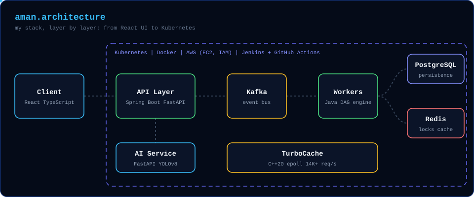
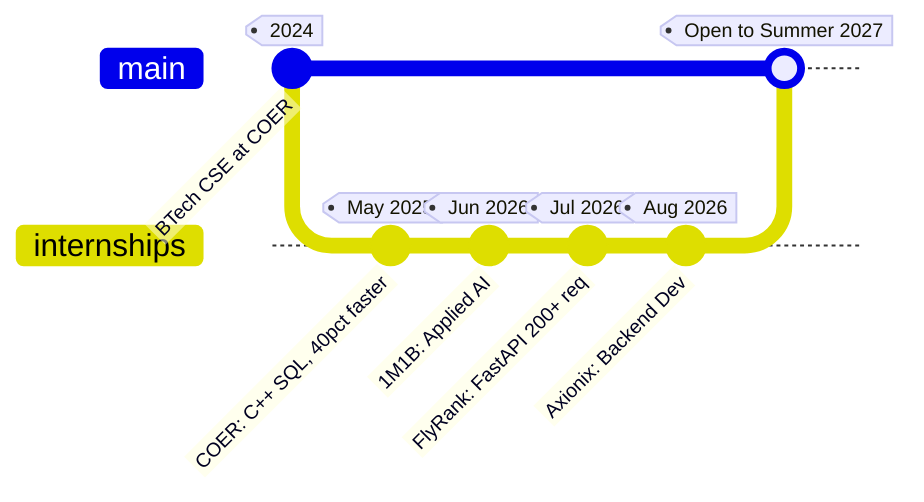
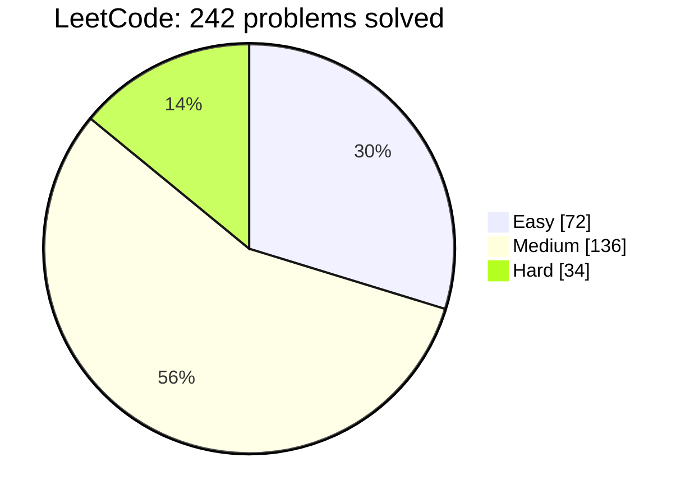

<div align="center">



<br/>

[](https://linkedin.com/in/aman-bhatti01)
[](https://leetcode.com/u/AmanBhatti01)
[](mailto:amanbhatti00187@gmail.com)

**Pre-final year B.Tech CSE @ COER · 4 internships · Open to SDE / Backend / Full Stack internships (Summer 2027)**

</div>

---

## `$ kubectl get pods -n aman`

```text
NAME                      READY   STATUS    RESTARTS   NOTES
java-spring-backend       1/1     Running   0          REST APIs, microservices, Hibernate
python-fastapi-service    1/1     Running   0          200+ concurrent inference requests
cpp20-systems             1/1     Running   0          TurboCache, 14K+ req/s
kafka-redis-postgres      1/1     Running   0          event-driven, distributed locks
react-ui                  1/1     Running   0          React Flow workflow builder
dsa-engine                1/1     Running   0          LeetCode Knight, 1955, top 3.35%
open-to-work              1/1     Running   0          Summer 2027 internships
```

---

## `$ open architecture`

<div align="center">

</div>

---

## `GET /api/aman`

```json
{
  "name": "Aman Bhatti",
  "status": 200,
  "education": "B.Tech CSE, COER (2024-2028), pre-final year",
  "roles": ["Backend Developer Intern", "ML Engineering Intern", "Applied AI Intern", "Software Dev Intern"],
  "strengths": ["REST APIs", "Microservices", "Distributed Systems", "Concurrency", "DSA"],
  "leetcode": { "level": "Knight", "rating": 1955, "top_percent": 3.35, "solved": 242 },
  "open_to_work": true
}
```

---

## 🧱 Full Stack, Layer by Layer

| Layer | Tech | Where I used it |
|---|---|---|
| **Frontend** | React, React Flow, TypeScript, JavaScript | FlowForge visual workflow builder |
| **Backend** | Java, Spring Boot, Hibernate, Python, FastAPI | Axionix, FlyRank, FlowForge, LuminaVision |
| **Messaging** | Apache Kafka | FlowForge async, event-driven execution |
| **Data** | PostgreSQL, MySQL, MongoDB, Redis | Schema design, indexing (+30% retrieval), distributed locks |
| **Systems** | C++20, Linux, epoll, Multithreading | TurboCache, 14K+ requests/sec |
| **DevOps / Cloud** | Docker, Kubernetes, AWS (EC2, IAM), Jenkins, GitHub Actions | FlowForge deployment, CI/CD |
| **AI / CV** | OpenCV, YOLOv8, Power BI | LuminaVision (~30 FPS), 1M1B |

---

## 🚀 Projects

<table>
<tr>
<td width="33%" valign="top">

### 🔥 FlowForge AI
**Distributed workflow orchestration**

DAG execution, retries, failure recovery. Kafka for async processing and Redis locks so concurrent workers never double-run a task.

`Java` `Spring Boot` `Kafka` `Redis` `PostgreSQL` `Docker` `Kubernetes`

[**View repo →**](https://github.com/Amanbhatti008/REPLACE-WITH-REPO-NAME)

</td>
<td width="33%" valign="top">

### ⚡ TurboCache
**C++20 in-memory cache engine**

Multithreaded, epoll-based networking, PMR memory optimization and LRU eviction. **14K+ req/s** in concurrent benchmarks.

`C++20` `Linux` `epoll` `CMake`

[**View repo →**](https://github.com/Amanbhatti008/REPLACE-WITH-REPO-NAME)

</td>
<td width="33%" valign="top">

### 🚗 LuminaVision ADAS
**Real-time driver assistance**

Lane detection, object recognition, collision-risk analysis and fatigue monitoring at **~30 FPS**, served via FastAPI with a telemetry dashboard.

`Python` `OpenCV` `YOLOv8` `FastAPI` `Docker`

[**View repo →**](https://github.com/Amanbhatti008/REPLACE-WITH-REPO-NAME)

</td>
</tr>
</table>

---

## 🌿 `git log --graph` (career)



---

## 🧠 DSA Engine



**Knight** · rating **1955** · global rank **28,650 / 884,439** · strong in Dynamic Programming, Backtracking, Divide and Conquer, Graphs.

<div align="center">

</div>

---

## 🏅 Achievements

- **GSSoC 2026**: accepted in Open Source and AI/Agents tracks
- **Amazon ML Summer School**: shortlisted for the selection process
- **EY National Competition**: selected for Round 2
- **Microsoft**: 4 badges in AI and Copilot · **Walmart Global Tech**: Advanced Software Engineering Simulation

---

<div align="center">

### `$ ping aman`

📫 [amanbhatti00187@gmail.com](mailto:amanbhatti00187@gmail.com) · 💼 [LinkedIn](https://linkedin.com/in/aman-bhatti01) · 🧩 [LeetCode](https://leetcode.com/u/AmanBhatti01)

<sub>Like this profile layout? Feel free to fork the idea. A ⭐ on my repos is always appreciated.</sub>

</div>
